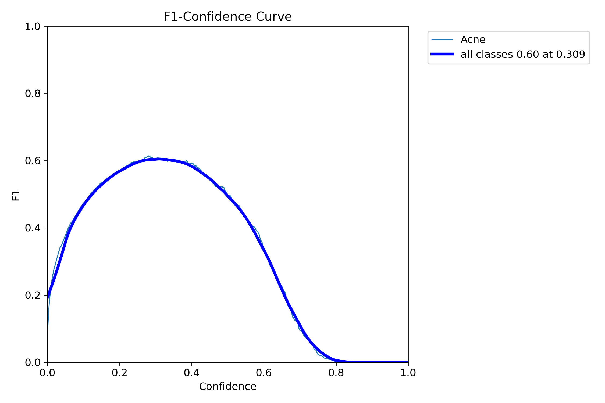

# Acne Detection Analysis

Based on this dataset [Acne Dataset in YOLOv8 Format](https://www.kaggle.com/datasets/osmankagankurnaz/acne-dataset-in-yolov8-format?resource=download)

## Install

Install pytorch and other requirements.

- Change directory to `mtr-skin-analysis/AcneDetectionAnalysis/`;

- Create the environment in conda with python 3.11:
```bash
conda create -n AcneDetectionAnalysis python=3.11 -y
conda activate AcneDetectionAnalysis
```

```bash
pip install -r requirements.txt
```

## Train

Download and unzip the [kaggle dataset](https://www.kaggle.com/datasets/osmankagankurnaz/acne-dataset-in-yolov8-format?resource=download).

```
unzip archive.zip
mv data-2/ acne-dataset
```

Change the file in acne-dataset/data.yaml with:

```
path: <Change for the full path to acne-dataset>
train: train/images
val: valid/images
test: test/images

nc: 1
names: ['Acne']
```

Run the training script

```
python scripts/train.py --model-name yolo26s --batch-size 8 --epochs 100 --patience 15
```

## Evaluate

```bash
python scripts/evaluate.py --model-name yolo26s
```

Output:

```
Loading the trained model for final evaluation of yolo26s...
Evaluating on the TEST dataset...
--- FINAL REAL-WORLD SCORES ---
mAP50 (Detection accuracy): 0.6416
mAP50-95 (Localization accuracy): 0.2873
```

```
mv ./runs/detect/val/BoxF1_curve.png ./
```



Get the confidence on *F1_curve.png* to run the inference with

```
python scripts/inference.py --model-name yolo26s --image-path "./test_images/" --confidence 0.309
```
